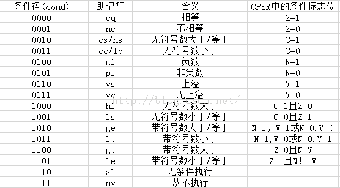
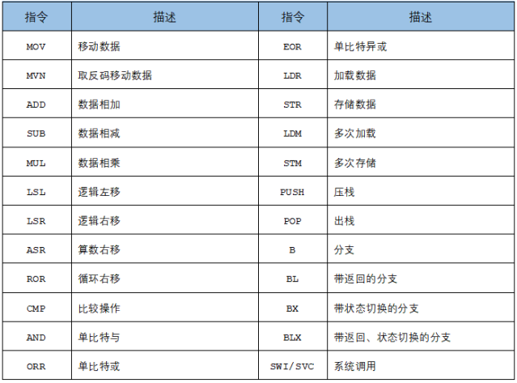

# ARM 指令概览

## 指令分类
1. 存储器访问指令
2. 数据处理指令
3. 分支指令
4. 程序状态寄存器访问指令
5. 协处理器类指令集

## 指令模板
 **MNEMONIC{S}{condition} {Rd}, Operand1, Operand2**
 1. MNEMONIC - 指令的助记符如ADD
 2. {S} - 可选的扩展位, 如果指令后加了S，将依据计算结果更新CPSR寄存器中相应的FLAG
 3. {condition} - 执行条件，如果没有指定，默认为AL(无条件执行)
 4. {Rd} - 目的寄存器，存储指令计算结果
 5. Operand1 - 第一个操作数，可以是一个寄存器或一个立即数
 6. Operand2 - 第二个(可变)操作数, 可以是一个立即数或寄存器甚至带移位操作的寄存器

### Condition(与CPSR的条件标志位对应)

### 第二可变操作数示例
1. #123 - 立即数
2. Rx - 寄存器比如R1
3. Rx, ASR n - 对寄存器中的值进行算术右移n位后的值
4. Rx, LSL n - 对寄存器中的值进行逻辑左移n位后的值
5. Rx, LSR n - 对寄存器中的值进行逻辑右移n位后的值
6. Rx, ROR n - 对寄存器中的值进行循环右移n位后的值
7. Rx, RRX - 对寄存器中的值进行带扩展的循环右移1位后的值

## 常见指令
